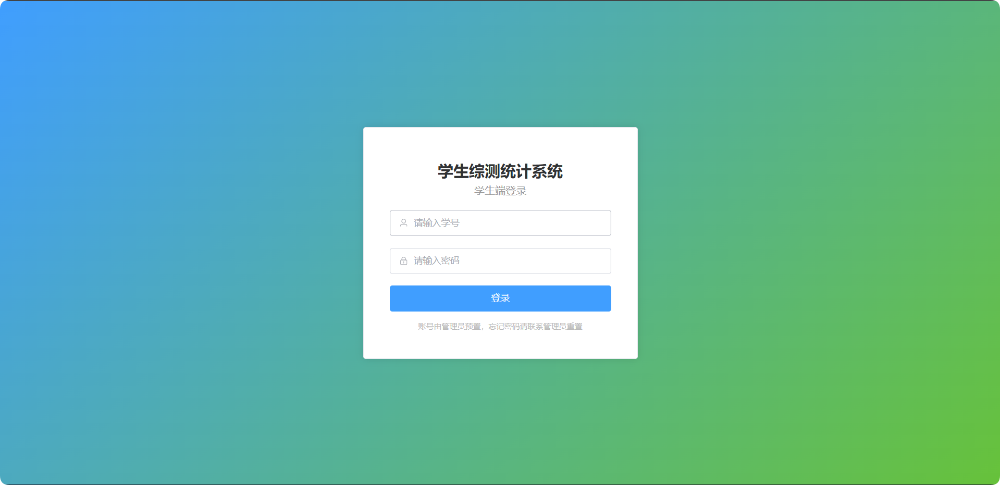
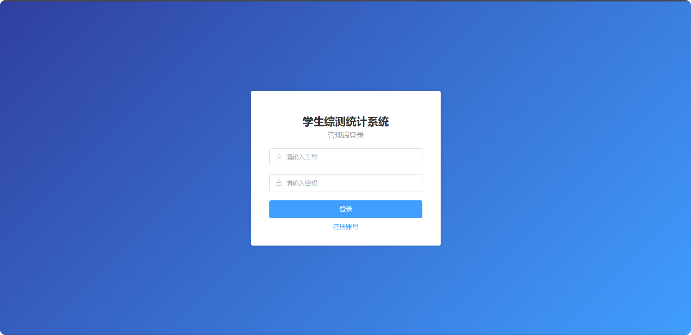
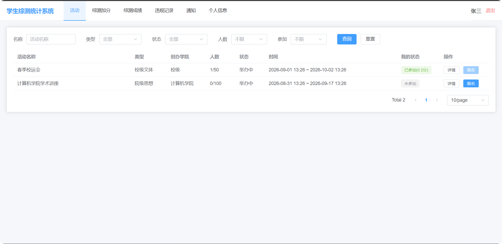
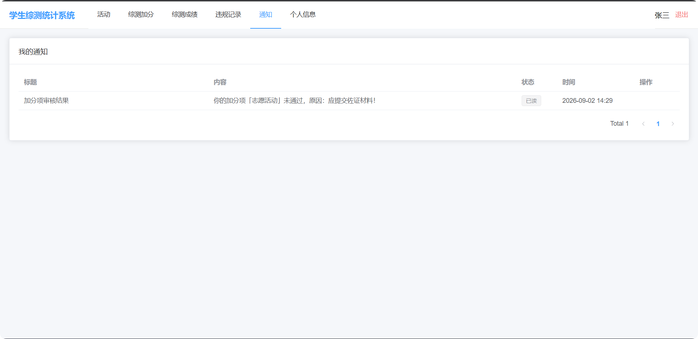
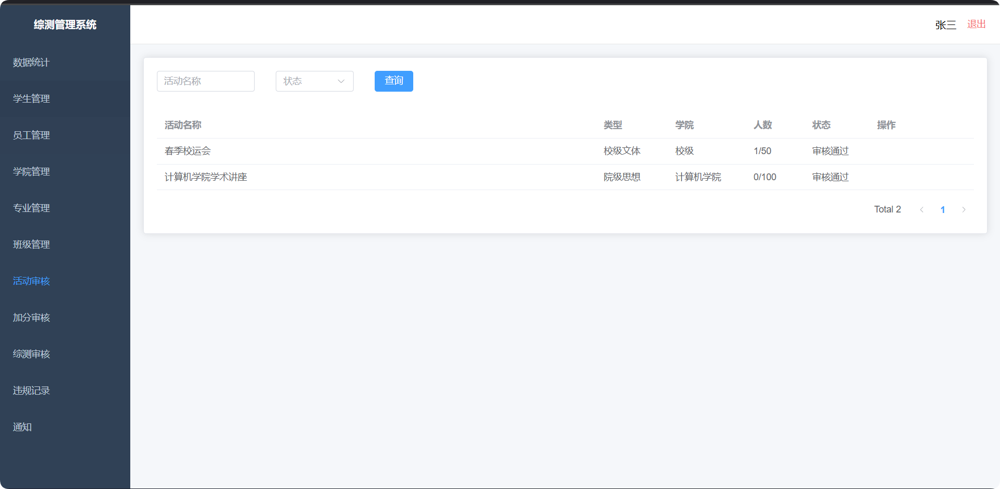
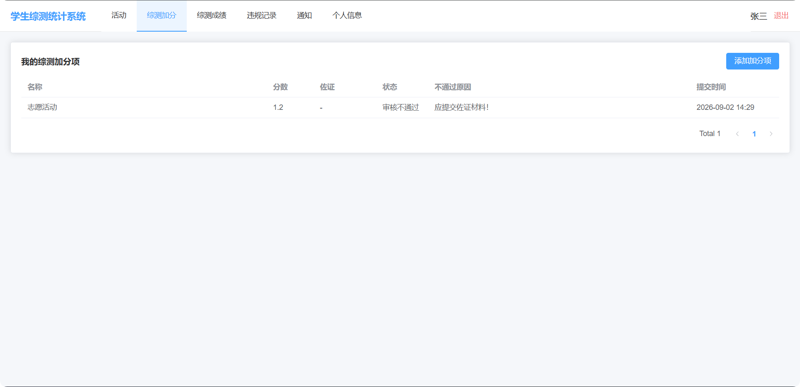

# 学生综测统计系统

高校学生综合素质测评系统，前后端分离架构，分**管理端（员工）**与**用户端（学生）**两个前端。

大部分重复工作和文档主要用ai生成，可能存在大量安全缺陷、业务功能问题和用户体验问题，需要根据实际情况持续改善

## 技术栈

| 端 | 技术 |
| --- | --- |
| 后端 | Java 21、Spring Boot 3.3、Maven、MyBatis-Plus、MySQL 8、Redis、Spring Cache、JWT、WebSocket、Spring Task、Knife4j |
| 前端 | Vue 3、Vite、Element Plus、Pinia、Vue Router、Axios、ECharts |
| 部署 | Nginx（反向代理、前后端分离） |

## 目录结构

```
项目根目录/
├── AI开发提示词.md           # 可复用的 AI 开发提示词
├── need.md                  # 原始需求
├── backend/                 # Spring Boot 后端（含 application-dev/prod 环境配置）
├── frontend/
│   ├── admin/               # 管理端（员工）
│   └── user/                # 用户端（学生）
├── docs/                    # 需求分析、API 文档
└── nginx.conf               # Nginx 配置示例
```

## 启动步骤

### 1. 准备环境

- JDK 21、Maven 3.8+、MySQL 8、Redis
- 修改 `backend/src/main/resources/application-dev.yml` 里的 `db.*` / `redis.*` 连接信息（默认已填好本地 MySQL 与 Redis）
- 生产环境使用 `application-prod.yml`，通过 `DB_HOST`、`DB_PASSWORD` 等环境变量注入，不在文件里写明文密码

### 2. 初始化数据库

执行后端自带的建表脚本：

```bash
mysql -uroot -p < backend/src/main/resources/sql/schema.sql
```

> 演示数据（学院、专业、班级、默认账号、示例活动）会在后端**首次启动时自动写入**，无需手动导入。

### 3. 启动后端

```bash
cd backend
mvn spring-boot:run
```

后端启动后：
- API 地址：`http://localhost:8080/api/v1`
- 接口文档（Knife4j）：`http://localhost:8080/doc.html`

### 4. 启动前端

用户端（学生）：

```bash
cd frontend/user
npm install
npm run dev        # http://localhost:5174
```

管理端（员工）：

```bash
cd frontend/admin
npm install
npm run dev        # http://localhost:5173
```

## 默认账号（演示数据）

| 端 | 账号 | 密码 | 说明 |
| --- | --- | --- | --- |
| 管理端 | `admin` | `admin123` | 管理员 |
| 管理端 | `2001` | `123456` | 辅导员（管理软件2201） |
| 管理端 | `2002` | `123456` | 教师（任职计算机学院） |
| 用户端 | `20220101` | `011234` | 张三，普通学生 |
| 用户端 | `20220102` | `011235` | 李四，学生会成员（可申请创建活动） |
| 用户端 | `20220103` | `011236` | 王五，普通学生 |

> 密码规则：学生默认密码为身份证号后 6 位；员工默认密码为 `123456`（管理员 `admin123`）。忘记密码只能由管理员在管理端「重置密码」。

## 核心功能

- **学生端**：登录、个人信息查询/修改、活动列表（多条件筛选+分页）、活动报名（满员拦截/不可退）、申请创建活动、添加综测加分（附佐证）、计算综测成绩（一年最多 2 个通过）、综测查询、WebSocket 实时通知。
- **员工端**：注册登录、学生/员工/学院/专业/班级/活动等条件分页查询与增删改、活动审核、加分项审核、添加违规记录、数据统计（学院/专业/班级均分、板块对比、活动统计）、班级加分审核、综测成绩审核、已审核综测查询。
- **定时任务**：每分钟踢出超员活动最后加入者并警报；每分钟超时活动置为已结束；每年 3 月 1 日、9 月 1 日提醒学生计算综测。

## 关键设计

- **密码安全**：BCrypt 加密，密码不出参（`@JsonProperty(WRITE_ONLY)`）。
- **鉴权**：JWT + 拦截器，`@RequireRole` 注解区分学生/员工端。
- **并发控制**：活动报名使用 Redis 分布式锁防超员。
- **综测上限**：一年最多 2 个审核通过，后端硬拦截。
- **集群广播**：WebSocket 通过 Redis 发布订阅实现跨实例消息推送。
- **缓存**：Spring Cache + Redis，减少 MySQL 查询，保证接口 ≤ 500ms。
- **多环境配置**：`application.yml` 用 `${db.*}` / `${redis.*}` 占位符，真实连接信息按环境放在 `application-dev.yml` / `application-prod.yml`，基础配置不含明文密码。

## 部署（Nginx）

见根目录 `nginx.conf` 示例，将前端构建产物与后端 API 统一反向代理。

## 相关文档

- [需求分析文档](docs/需求分析文档.md)
- [API 接口文档](docs/API接口文档.md)

## 预览





